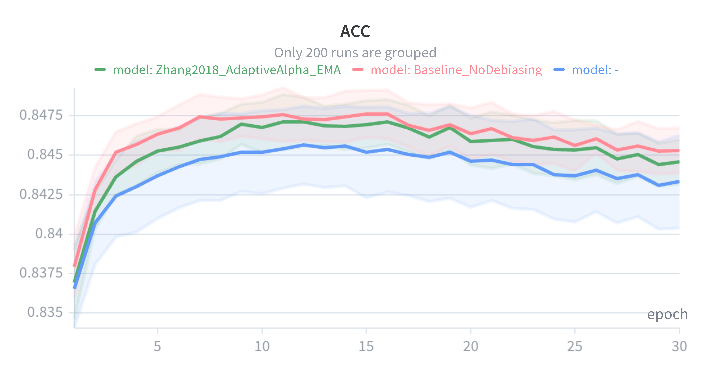
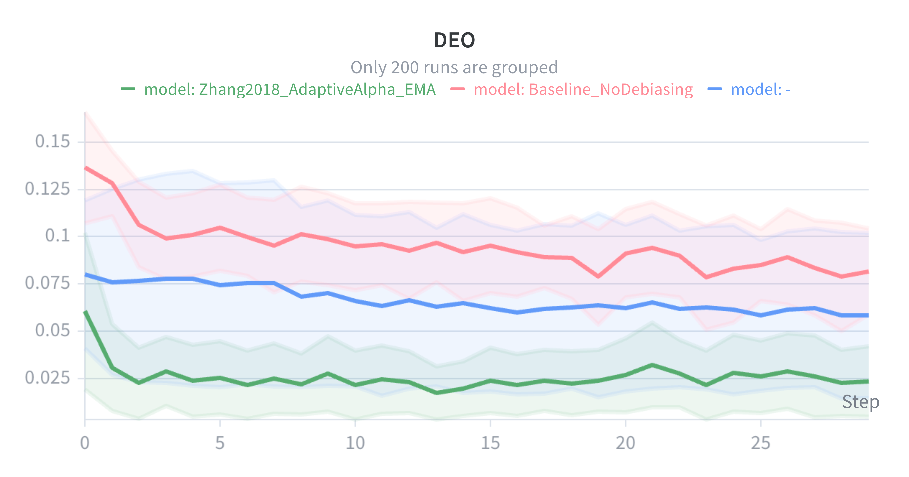
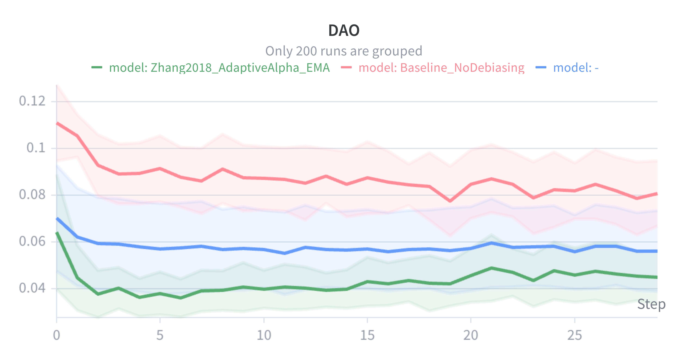
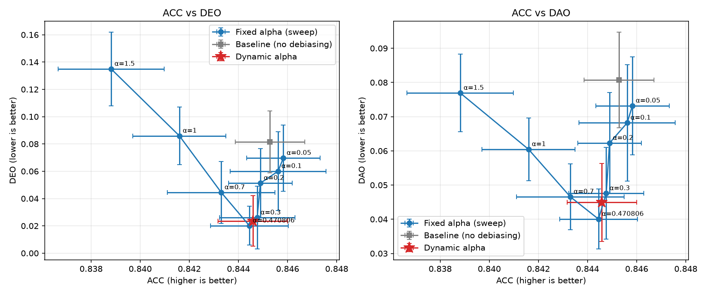

# Adaptive Alpha Control

**A self-adjusting alternative to fixed-weight adversarial debiasing.**

Adversarial debiasing is a way to train a model that's less biased. It works by pitting two models against each other: one tries to make a prediction, the other tries to guess a sensitive attribute (like gender) from that prediction. How much the first model listens to the second is controlled by a single number, usually written as `α` (alpha).

Normally, `α` is picked once, by hand, before training starts. Pick it too low and the model stays biased; too high and accuracy suffers. This project replaces that manual guess with a controller that watches accuracy and fairness during training and adjusts `α` automatically, every epoch.

---

## How it works

Two models train together:

- **The predictor** — predicts whether someone's income is above $50k, from census data.
- **The adversary** — tries to guess someone's gender, but only from the predictor's output (not the raw data).

If the adversary can guess gender accurately, that's a sign the predictor's output is leaking gender information. So the predictor is trained to do two things at once: predict income correctly, and give the adversary as little to work with as possible.

`α` controls how much weight the second goal gets. This repo compares three ways of setting it, all using the same model and data, so the comparison is fair:

| Script | What it does |
| --- | --- |
| [`baseline.py`](baseline.py) | No adversary at all — just the predictor. A reference point with no fairness effort. |
| [`fixed.py`](fixed.py) | Adversarial debiasing with a fixed `α`, tried across 8 different values (multiple runs each) to map out the trade-off between fairness and accuracy. |
| [`dynamic.py`](dynamic.py) | **Adaptive Alpha Control** — `α` is recalculated every epoch based on how accuracy and fairness are trending. |

---

## Why test 8 fixed values instead of just one

Comparing the adaptive controller against a single fixed `α` isn't a fair test — if that one value happens to be a bad choice, the adaptive method looks better for the wrong reason.

So `fixed.py` runs the model at 8 different fixed alphas (`0.05, 0.1, 0.2, 0.3, 0.4708, 0.7, 1.0, 1.5`), each with several random seeds. Plotting all of them together gives a curve of the best possible trade-offs between accuracy and fairness — a Pareto frontier. The adaptive controller is then judged against that whole curve, not one lucky (or unlucky) point on it.

---

## Model setup

Same predictor and adversary architecture in all three scripts:

**Predictor:** 99 input features → 64 neurons → 32 neurons → 1 output (income prediction)

**Adversary:** predictor's single output number → 32 neurons → 1 output (gender guess)

The adversary never sees the original data — only the predictor's answer — so it can only guess gender correctly if that answer is carrying a gender signal.

---

## The adaptive controller, in short (`dynamic.py`)

At the end of each epoch, the controller:

1. Measures accuracy, DEO, and DAO (fairness metrics, explained below) on test data.
2. Checks how much each one moved since last epoch.
3. Smooths those changes over time, so one noisy epoch doesn't cause an overreaction.
4. Combines them into a single "pressure" score.
5. Uses that score to nudge `α` up or down for the next epoch.

If bias is trending up, pressure rises and `α` goes up — leaning harder on the adversary. If accuracy is improving, pressure is pulled back down, so accuracy isn't sacrificed for a fairness gain that was already happening on its own.

**Safety net:** if accuracy ever drops below 0.84, the controller ignores everything else and pushes `α` back down, to protect accuracy first.

---

## Fairness metrics, briefly

All three scripts measure the same things on held-out test data:

- **ACC (Accuracy)** — how often the income prediction is correct. Higher is better.
- **DEO (Difference in Equal Opportunity)** — among people who actually earn over $50k, is the model equally good at spotting them across genders? Lower is better.
- **DAO (Difference in Average Odds)** — a broader version of DEO that also accounts for false positives. Lower is better.

---

## Results

Charts below are averaged over 30 training runs each (shaded band = spread across runs), from Weights & Biases:

- 🟢 green = `Zhang2018_AdaptiveAlpha_EMA` — the adaptive controller (this project's method)
- 🔴 red = `Baseline_NoDebiasing` — no fairness effort
- 🔵 blue = the fixed-alpha sweep average

### Accuracy over training



Accuracy stays close across all three. The adaptive controller (green) tracks just under the baseline (red), while the fixed-alpha average (blue) sits a bit lower and more spread out — because it includes some alpha values that are too aggressive for accuracy.

### Equal Opportunity gap over training — lower is better



The adaptive controller (green) drops fastest and stays lowest almost the whole way through training, well below both the baseline and the fixed-alpha average.

### Average Odds gap over training — lower is better



Same story here — green settles lowest and stays there.

### Accuracy vs. fairness trade-off (Pareto frontier)



This plots every fixed-alpha run against the adaptive controller (red star) on the same axes, so the full trade-off curve is visible at once, not just one point on it. The dynamic controller lands right on the frontier, next to the `α = 0.3`–`0.4708` cluster — not off to the side or dominated by it.

### Final numbers (mean ± std over 30 runs each)

All three scripts now use the same, bug-fixed preprocessing code, and the fixed-alpha sweep covers all 8 planned values — so this table reflects a like-for-like comparison.

| Model | ACC ↑ | DEO ↓ | DAO ↓ |
| --- | --- | --- | --- |
| Baseline (no debiasing) | 0.8453 ± 0.0014 | 0.0816 ± 0.0223 | 0.0807 ± 0.0138 |
| Fixed Alpha (α = 0.05) | 0.8458 ± 0.0015 | 0.0697 ± 0.0239 | 0.0732 ± 0.0141 |
| Fixed Alpha (α = 0.1) | 0.8456 ± 0.0019 | 0.0600 ± 0.0284 | 0.0682 ± 0.0168 |
| Fixed Alpha (α = 0.2) | 0.8449 ± 0.0013 | 0.0513 ± 0.0248 | 0.0623 ± 0.0145 |
| Fixed Alpha (α = 0.3) | 0.8448 ± 0.0015 | 0.0260 ± 0.0226 | 0.0476 ± 0.0132 |
| Fixed Alpha (α = 0.4708) | 0.8444 ± 0.0016 | 0.0201 ± 0.0140 | 0.0401 ± 0.0086 |
| Fixed Alpha (α = 0.7) | 0.8433 ± 0.0022 | 0.0445 ± 0.0222 | 0.0466 ± 0.0095 |
| Fixed Alpha (α = 1.0) | 0.8416 ± 0.0019 | 0.0859 ± 0.0208 | 0.0605 ± 0.0090 |
| Fixed Alpha (α = 1.5) | 0.8388 ± 0.0021 | 0.1349 ± 0.0266 | 0.0769 ± 0.0112 |
| **Dynamic Alpha (adaptive, ours)** | 0.8446 ± 0.0014 | 0.0236 ± 0.0183 | 0.0449 ± 0.0112 |

**Honest read of this table:** the adaptive controller beats the baseline and most fixed alphas comfortably on both fairness metrics, while barely giving up any accuracy. The closest fixed point, `α = 0.4708` (its own starting value), edges it out slightly on DEO/DAO alone — but it also has *lower* accuracy than the dynamic controller, so neither point beats the other outright: they sit on the same trade-off frontier, not one dominating the other. The real value of the adaptive approach is landing on that frontier automatically, without having to sweep 8 values and pick the best one in advance.

Source data for this table: [`results/wandb_final_results.csv`](results/wandb_final_results.csv).

### Is the adaptive controller also more stable, not just fairer?

Yes, on the fairness metrics. Rather than eyeballing the chart bands, this was checked directly by pulling the full per-epoch history (all 30 epochs × all 300 runs, not just the final-epoch summary) from the W&B API — see [`fetch_run_histories.py`](fetch_run_histories.py) and [`results/wandb_full_history.csv`](results/wandb_full_history.csv). Two things were measured, both averaged over epochs 10–30 (after the initial ramp-up settles):

- **Cross-seed spread at a given epoch** — how much the 30 seeds disagree with each other at any point in training (this is what the shaded chart bands show):

  | Model | ACC std | DEO std | DAO std |
  | --- | --- | --- | --- |
  | Baseline | 0.0015 | 0.0238 | 0.0140 |
  | Fixed Alpha (avg of all 8) | 0.0027 | 0.0423 | 0.0182 |
  | **Dynamic Alpha (adaptive)** | 0.0015 | **0.0180** | **0.0105** |

- **Epoch-to-epoch jitter within a single run** — the average size of the swing from one epoch to the next, per run:

  | Model | ACC Δ | DEO Δ | DAO Δ |
  | --- | --- | --- | --- |
  | Baseline | 0.00140 | 0.02418 | 0.01458 |
  | Fixed Alpha (avg of all 8) | 0.00149 | 0.02290 | 0.01181 |
  | **Dynamic Alpha (adaptive)** | 0.00135 | **0.01872** | **0.01102** |

So the adaptive controller is genuinely more stable on fairness — both in how much seeds disagree with each other, and in how much a single run wobbles epoch to epoch — not just an impression from the chart. On accuracy, the three are close enough (0.0015 vs 0.0015 vs 0.0027 std; 0.00135–0.00149 jitter) that there's no meaningful stability difference either way.

---

## Dataset

**UCI Adult Income Dataset** (`data/adult.tsv`)

- **Task:** predict whether someone's annual income is above $50,000.
- **Sensitive attribute:** gender (binary in this dataset — see [Ethical Considerations](#ethical-considerations)).

Preprocessing, shared across all three scripts:

- Drop rows with missing values
- Strip whitespace from text columns
- One-hot encode categorical columns (workclass, education, marital status, occupation, relationship, race, native country)
- Standardise numeric columns
- 80/20 train/test split, stratified by income, `random_state=42`
- ~45k records, 99 features per row after encoding

`data/German.tsv` (German Credit dataset) is also present but not used by any script yet — kept for a possible future second dataset.

---

## Hyperparameters (`dynamic.py`)

Found via a Weights & Biases hyperparameter sweep.

| Parameter | Value |
| --- | --- |
| Epochs | 30 |
| Batch Size | 256 |
| Learning Rate | 1e-3 |
| Alpha Initial | 0.4708055928 |
| Alpha Minimum | 0.01 |
| Alpha Maximum | 1.0048358312 |
| Alpha Learning Rate | 0.4468379573 |
| Accuracy Floor | 0.84 |
| EMA Smoothing | 0.3601034154 |
| W_DEO | 0.6689005575 |
| W_DAO | 1.9288807993 |
| W_ACC | 4.6453214453 |

`fixed.py` reuses the same epochs/batch-size/learning rate, but sweeps `α` itself instead of using a controller. `baseline.py` reuses the same settings with no `α` and no adversary at all.

---

## Experimental setup

All three scripts share the same data loading, preprocessing, model-building code, metric calculations, the same 30 seeds (0–29), and log to the same W&B project — so the only thing that differs is how (or whether) `α` and the adversary are used.

| Script | Seeds | W&B project | W&B group |
| --- | --- | --- | --- |
| `baseline.py` | 30 (seeds 0–29) | `final_results` | `Baseline` |
| `fixed.py` | 30 per alpha × 8 alphas | `final_results` | `FixedAlpha_<alpha>` |
| `dynamic.py` | 30 (seeds 0–29) | `final_results` | `DynamicAlpha` |

Two bugs used to break this comparison and have since been fixed:

- **Preprocessing bug:** `baseline.py` and `dynamic.py` were filtering for text columns using the wrong pandas dtype, so whitespace-stripping silently never ran. `fixed.py` already had it right. All three now use the same, correct filter — the [Results](#results) table above reflects this fix.
- **`baseline.py` scope:** it used to train a single seed into a separate, older W&B project. It's now rewritten to run the same 30 seeds, log to the same project, and use the same training loop structure as the other two scripts.

---

## Installation

Clone the repository:

```bash
git clone https://github.com/lewis-shearer/Adaptive-Alpha-Control.git
cd Adaptive-Alpha-Control
```

Install dependencies:

```bash
pip install tensorflow numpy pandas scikit-learn wandb
```

You'll need:

- Python 3.10+
- TensorFlow
- NumPy
- Pandas
- Scikit-learn
- A Weights & Biases account (`wandb login` before running anything)

---

## Running experiments

Make sure the dataset is here:

```text
data/adult.tsv
```

Then run whichever version you want:

```bash
python baseline.py   # no debiasing, 30 seeds
python fixed.py       # 8-value alpha sweep, 30 seeds each
python dynamic.py     # adaptive alpha controller, 30 seeds
```

`fixed.py` also saves a local summary to `fixed_alpha_sweep_results.csv`, so the trade-off curve can be rebuilt without needing W&B access.

---

## Running the fixed-alpha sweep across multiple machines

`fixed.py` runs its whole grid of alphas and seeds one at a time, on one machine. To split the work across several machines instead (say, a MacBook plus a couple of Windows laptops), use [`fixed_sweep.py`](fixed_sweep.py) with [`sweep_fixed.yaml`](sweep_fixed.yaml) — this runs the same grid as a proper **W&B Sweep**.

Each machine asks W&B for the next unclaimed (alpha, seed) pair, runs it, and asks for another — so all machines chip away at the same grid at once, with no manual splitting and no risk of duplicate work.

```bash
# once, on any one machine — creates the sweep and prints a SWEEP_ID
wandb sweep sweep_fixed.yaml

# on every machine you want contributing runs (repeat per machine)
wandb agent <entity>/<project>/<SWEEP_ID>
```

Every run from the sweep logs the same metrics and follows the same naming convention as a manual `fixed.py` run, so results from both are interchangeable in the same `final_results` project. There's no shared local CSV across machines though — pull final numbers back afterward via a W&B export or `wandb.Api()`.

---

## Weights & Biases logging

- `dynamic.py` logs, per epoch: `ACC`, `DEO`, `DAO`, `alpha`, `pressure`, `ema_ddeo`, `ema_ddao`, `ema_dacc`, `pred_loss`, `adv_loss`.
- `fixed.py` logs, per epoch: `ACC`, `DEO`, `DAO`, `alpha`, `pred_loss`, `adv_loss`.
- `baseline.py` logs, per epoch: `ACC`, `DEO`, `DAO`, `pred_loss`.

Run naming:

```text
baseline_adult_gender_seed<seed>            # baseline.py
fixed_alpha<alpha>_adult_gender_seed<seed>  # fixed.py
dynamic_adult_gender_seed<seed>             # dynamic.py
```

---

## Repository structure

```text
Adaptive-Alpha-Control/
│
├── data/
│   ├── adult.tsv        # used by all three scripts
│   └── German.tsv       # present, not currently used
│
├── results/                    # charts and exported data shown in this README
│   ├── acc_over_epochs.png
│   ├── deo_over_epochs.png
│   ├── dao_over_epochs.png
│   └── wandb_final_results.csv
│
├── baseline.py            # no debiasing
├── fixed.py               # fixed-alpha sweep (single machine)
├── fixed_sweep.py         # fixed-alpha sweep (W&B Sweep, multi-machine)
├── sweep_fixed.yaml       # grid config for fixed_sweep.py
├── dynamic.py             # adaptive alpha controller
├── analyze_results.py     # builds the Pareto frontier plot
├── pareto_frontier.png    # accuracy vs. fairness trade-off chart
│
└── README.md
```

---

## Ethical considerations

Adaptive Alpha Control improves the fairness metrics it's measured on — it doesn't guarantee fairness in a broader sense. Some important limits:

- Gender is treated as binary here, because that's how the UCI Adult dataset records it
- The model learns from historical census data, which carries its own historical biases
- DEO and DAO are specific definitions of fairness — they don't capture every notion of what "fair" means
- Other features correlated with gender could still let bias leak through indirectly
- The fairness-accuracy trade-off is shaped by controller settings (`W_DEO`, `W_DAO`, `W_ACC`), which were themselves chosen via a hyperparameter sweep, not first principles

This project is a tool for reducing bias, not a complete solution to fairness.

---

## Acknowledgements

This project builds on:

Zhang, B. H., Lemoine, B., & Mitchell, M. (2018). *Mitigating Unwanted Biases with Adversarial Learning.* Proceedings of the AAAI/ACM Conference on AI, Ethics, and Society.
